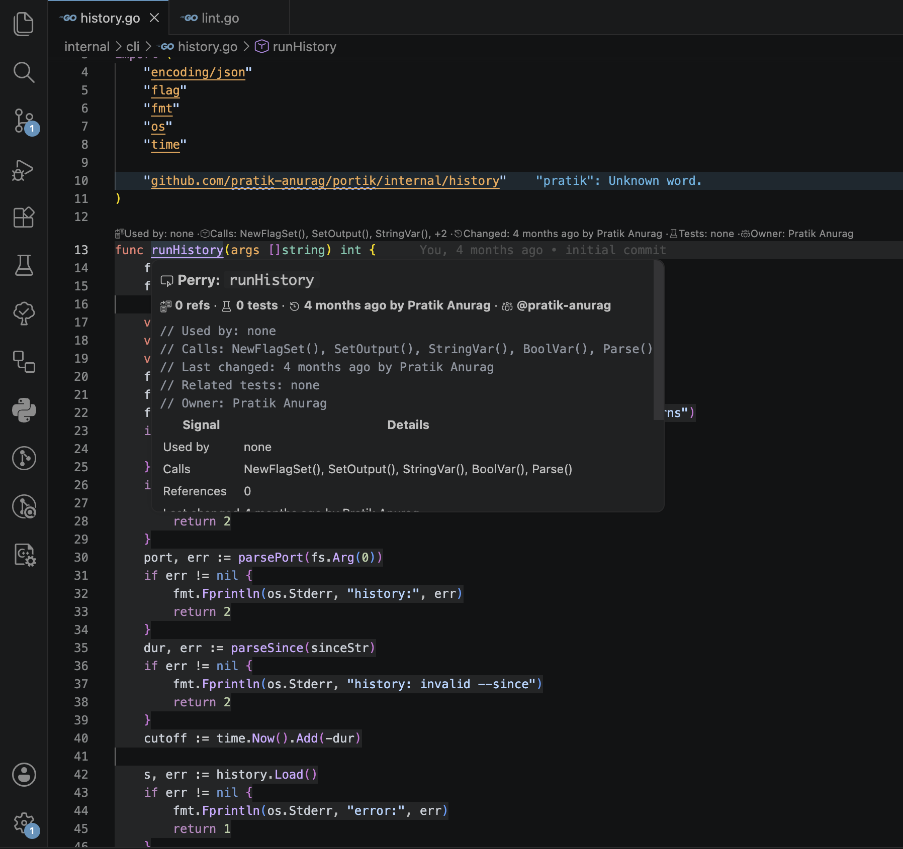

# Perry Code Context

Perry Code Context is a local-first VS Code extension that shows readable CodeLens context above meaningful symbols in supported source files. It helps answer who uses code, what it calls, who last touched it, which tests look related, and who likely owns the file.

Perry starts only when you ask it to. Run `Perry: Start` from the Command Palette to enable its CodeLens, hover, symbol links, local file watching, and details panel. Run `Perry: Stop` when you want it fully dormant again.

Example context:



The editor line above a symbol uses VS Code CodeLens, so it reserves space and does not overlap source text. Hover a function, method, class, interface, or module to see the full comment-style context card with actions. Where VS Code document links are available, Ctrl/Cmd-click the symbol name to open the details panel.

## Supported Languages

- TypeScript
- JavaScript
- TSX
- JSX
- Python
- Go

## Requirements

- VS Code 1.85 or newer
- Local workspace files
- Git installed for Git context
- A language server for reference counts

No external services, API keys, AI integration, telemetry, or network calls are required at runtime.

## Settings

- `perry.enabled`: enable or disable inline annotations after Perry has been manually started. Default: `true`
- `perry.showInlineContext`: deprecated. Inline decoration blocks are disabled because they do not reserve editor space. Default: `false`
- `perry.showDetailsLens`: show the non-overlapping CodeLens summary. Default: `true`
- `perry.enableHover`: show a rich hover card on supported symbols. Default: `true`
- `perry.enableSymbolLinks`: make symbol names Ctrl/Cmd-clickable where VS Code document links are available. Default: `true`
- `perry.maxSymbolsPerFile`: maximum symbols per file. Default: `100`
- `perry.enableGit`: include Git blame/log context. Default: `true`
- `perry.enableReferences`: include language server reference counts. Default: `true`
- `perry.enableTests`: search related local tests. Default: `true`
- `perry.enableOwners`: match local CODEOWNERS rules. Default: `true`

## Commands

- `Perry: Start` (`perry.start`)
- `Perry: Stop` (`perry.stop`)
- `Perry: Refresh` (`perry.refresh`)
- `Perry: Show Details` (`perry.showDetails`)
- `Perry: Toggle` (`perry.toggle`)
- `Perry: Show Diagnostics` (`perry.showDiagnostics`)

`Perry: Show Diagnostics` reports command-layer activation time, the latest Perry start time, heap deltas, and current extension-host memory. VS Code runs extensions in a shared extension host, so memory values are process-level rather than exact Perry-only memory.

## CODEOWNERS

Perry looks for CODEOWNERS in:

- `.github/CODEOWNERS`
- `CODEOWNERS`
- `docs/CODEOWNERS`

It uses a practical local parser that ignores comments and blank lines, applies the last matching rule, and supports simple `*` globs, path prefixes, file suffixes such as `*.ts`, and directory patterns ending in `/`.

## Related Test Discovery

The extension searches:

- `**/*.{test,spec}.{ts,tsx,js,jsx,py}`
- `**/*_test.go`
- `**/__tests__/**/*.{ts,tsx,js,jsx,py}`
- `tests/**/*.{py,ts,tsx,js,jsx,go}`

A test is considered related when it contains the symbol name or its filename contains the source filename stem. Details are limited to five related tests per symbol.

## Known Limitations

- Reference counts depend on the active VS Code language server.
- Git context uses local `git blame` for the symbol line and falls back to `git log` for the file.
- CODEOWNERS matching is intentionally simple and does not implement the full GitHub CODEOWNERS grammar.
- Test discovery is heuristic and local-only.

## Development

```sh
npm install
npm run compile
npm test
```

Press `F5` in VS Code to launch an Extension Development Host, then open a supported source file.

## Architecture Notes

- [docs/architecture.md](docs/architecture.md) explains Perry's runtime lifecycle, data flow, cache boundaries, and extension points.
- [docs/adr](docs/adr) records architectural decisions.
